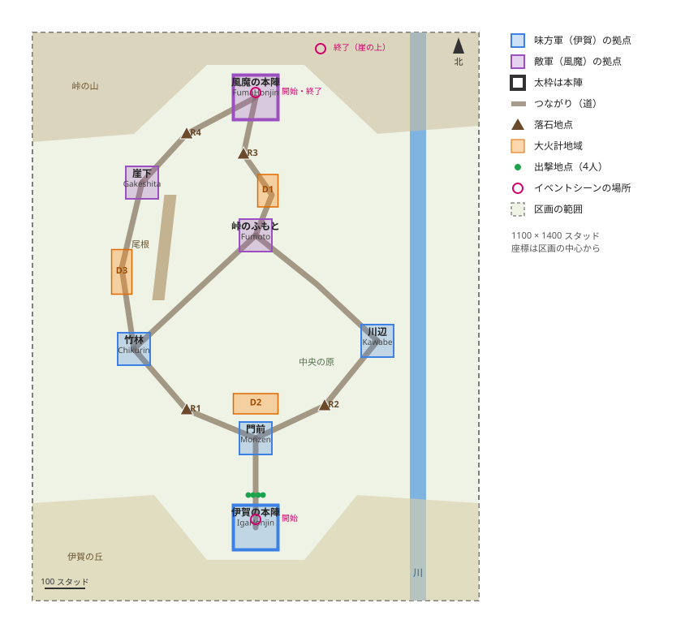

# 伊賀第1ステージの配置図

伊賀第1ステージ（`Iga1`）の区画に置く拠点・道・秘計の地点・出撃地点・イベントシーンの場所。
地形（#37）、建物（#43）、拠点と部隊（#117）、落石地点と大火計地域（#124）はこの図に沿って作る。
位置と形はプレースの目印、構成はコードに置く（[ADR 0006](../adr/0006-positions-as-markers-composition-in-code.md)）。
ここの座標は目印を置く目安で、地形に合わせて動かしてよい。動かしたらこの文書と図を直す。

## 区画

- 範囲は東西 1100 × 南北 1400 スタッド
- 座標は区画の中心からのスタッド（X は東が +、Z は南が +、北は -Z）
- ワールドでの区画の中心は (3000, 0, 0) を目安にする
- ロビー（原点の近く）と区画の端のあいだは 2000 スタッド以上
- 区画どうしとロビーは StreamingTargetRadius（既定 1024）以上離す
- 北の峠に風魔の本陣、南の丘に伊賀の本陣を置き、プレイヤーは南から北へ攻め上がる

## 地形

| 場所 | 高さ | 役目 |
|---|---|---|
| 伊賀の丘 | 20 | 伊賀の本陣を置く。北の門前へ下る坂 |
| 中央の原 | 0〜5 | 谷の底。両軍の部隊がぶつかる |
| 川 | 川底 -6 | 東の端（x 380〜420）を南北に流れる。川辺の拠点は西岸 |
| 尾根 | 30 | 竹林から崖下への小道と、中央の道を分ける |
| 峠のふもと | 12 | 峠への上りの入口 |
| 峠道 | 12〜60 | 峠のふもとから風魔の本陣への九十九折り |
| 崖下 | 24 | 峠の西の崖のふもと |
| 峠 | 60 | 風魔の本陣を置く |
| 北東の崖の上 | 115 | 終了のイベントシーンだけで使う。プレイヤーは登れない |

開始のイベントシーンの霧は、地形ではなく演出（Atmosphere）で出す。

## 拠点

| ID | 名前 | 種類 | 初期の軍 | 中心 (x, z) | 高さ | 内寸 | 出入り口 |
|---|---|---|---|---|---|---|---|
| `IgaHonjin` | 伊賀の本陣 | 本陣 | 味方軍 | (0, 520) | 20 | 110 × 110 | 北 |
| `Monzen` | 門前 | 通常拠点 | 味方軍 | (0, 300) | 8 | 80 × 80 | 南・西・東・北 |
| `Chikurin` | 竹林 | 通常拠点 | 味方軍 | (-300, 80) | 4 | 80 × 80 | 南東・北東・北 |
| `Kawabe` | 川辺 | 通常拠点 | 味方軍 | (300, 60) | 0 | 80 × 80 | 南西・北西 |
| `Fumoto` | 峠のふもと | 通常拠点 | 敵軍 | (0, -200) | 12 | 80 × 80 | 南西・南東・北 |
| `Gakeshita` | 崖下 | 通常拠点 | 敵軍 | (-280, -330) | 24 | 80 × 80 | 南・北東 |
| `FumaHonjin` | 風魔の本陣 | 本陣 | 敵軍 | (0, -540) | 60 | 110 × 110 | 南・南西 |

- 拠点は7個（両軍の本陣を含む）
- 味方軍（伊賀）が4個、敵軍（風魔）が3個
- 峠のふもとは開始の時点で風魔に奪われている（あらすじのとおり）
- 内寸は柵の内側の広さで、拠点の目印のパーツの大きさにする
- 柵は高さ 10、出入り口の幅は 16
- 出入り口はつながりの道が着く向きに開ける（門前の北は中央の原から攻め込む口）

### 内寸の理由

- 通常拠点の 80 × 80 は、4人がチャージ攻撃（C6 の半径 13）を振り回し、守備の下忍が30体ほど入っても動ける広さ
- 本陣の 110 × 110 は、首領と取り巻きを相手に4人が散って戦える広さ
- 本陣の中には櫓や陣幕を置き、イベントシーンの背景にする（#43）

## つながり

| 両端 | 経由点 (x, z) | 道のり | 道 |
|---|---|---|---|
| `IgaHonjin` – `Monzen` | なし | 220 | 丘を下る坂 |
| `Monzen` – `Chikurin` | (-170, 230) | 382 | 西への切り通し |
| `Monzen` – `Kawabe` | (170, 220) | 394 | 川沿いの土手 |
| `Chikurin` – `Fumoto` | (-150, -60) | 410 | 中央の原の西を横切る |
| `Kawabe` – `Fumoto` | (150, -80) | 397 | 中央の原の東を横切る |
| `Chikurin` – `Gakeshita` | (-330, -120) | 418 | 尾根の西の小道 |
| `Fumoto` – `FumaHonjin` | (40, -300)、(-30, -400) | 373 | 九十九折りの峠道 |
| `Gakeshita` – `FumaHonjin` | (-170, -450) | 355 | 崖沿いの道 |

- 経由点は `KyotenA` から `KyotenB` へ、表の左の拠点から右の拠点の向きに並べる
- 開始時の伊賀の兵站線は、本陣から門前、門前から竹林と川辺
- 開始時の風魔の兵站線は、本陣から峠のふもとと崖下
- 開始時に孤立した拠点は無い
- 本陣から本陣までの最短の道のりは約 1385 スタッド（移動速度 24 で約 1 分）

## 落石地点

| ID | 区間（`KyotenA` – `KyotenB`） | 位置 (x, z) | 塞ぐと |
|---|---|---|---|
| `R1` | `Monzen` – `Chikurin` | (-170, 230) | 伊賀の竹林が孤立する |
| `R2` | `Monzen` – `Kawabe` | (170, 220) | 伊賀の川辺が孤立する（呂屯の落石の想定） |
| `R3` | `Fumoto` – `FumaHonjin` | (-30, -400) | 風魔の峠のふもとが孤立する |
| `R4` | `Gakeshita` – `FumaHonjin` | (-170, -450) | 風魔の崖下が孤立する |

- 風魔の兵站線に2か所（`R3`・`R4`）、伊賀の兵站線に2か所（`R1`・`R2`）
- どれも道幅が狭く、岩で塞げる場所に置く（切り通し、土手、峠道の曲がり、崖沿い）

## 大火計地域

| ID | 場所 | 中心 (x, z) | 大きさ (x × z) | 想定 |
|---|---|---|---|---|
| `D1` | 峠道の九十九折り | (30, -310) | 50 × 80 | 峠道を下りる風魔の部隊を焼く |
| `D2` | 門前の北の口の前 | (0, 215) | 110 × 50 | 門前に押し寄せる部隊を焼く |
| `D3` | 尾根の西の小道 | (-330, -110) | 50 × 110 | 小道を通る部隊を焼く |

- 3か所とも、部隊が細く列になる道か、拠点の手前に置く
- 両軍が使える（`D2` を風魔が使うと、門前を守る伊賀の部隊が焼ける）

## 出撃地点

- 伊賀の本陣の北の出入り口の外
- `1`〜`4` を z = 440、x = -18・-6・6・18 に横一列、高さ 20
- 北（-Z）を向く

## イベントシーンの場所

シーン ID は仮（`Iga1Start` が開始、`Iga1Victory` が勝利の終了）。
目印は `Iga1.Mejirushi.EventScene.<シーン ID>` の下に置く。

| シーン | 場所 | 役者の立ち位置 (x, z) | カメラの目安 |
|---|---|---|---|
| 開始 | 風魔の本陣 | アトザ (0, -565)、アウン (-12, -560)、呂屯 (12, -560)、断 (20, -575)。南を向く | 峠の上 (0, 130, -640) から谷を見下ろす |
| 開始 | 伊賀の本陣 | 櫓 (0, 535) の前にハヤテ (0, 505)、令 (-12, 505)、餡音 (12, 505)、紫苑 (18, 510)。北を向く | 北の口の外 (0, 35, 430) から櫓へ |
| 開始 | 伊賀の本陣 | `Player1`〜`Player4` を z = 480、x = -18・-6・6・18 に並べ、ハヤテへ向ける | 背中から（台本の S16） |
| 終了 | 風魔の本陣 | アトザ (0, -545) が膝をつく。アウンは (-25, -545) から駆け寄る。呂屯 (10, -565)、断 (18, -565) | 南から本陣の奥へ |
| 終了 | 風魔の本陣 | `Player1`〜`Player4` は手前に半円（(-14, -530)、(-6, -523)、(6, -523)、(14, -530)）。ハヤテは (40, -525) から来る | 南から |
| 終了 | 北東の崖の上 (160, -660、高さ 115) | 風魔の初代首領の影 | 崖の西から見上げ、東の朝日を逆光にする |

## 30分の目安

隣の拠点までは 220〜420 スタッドある。
プレイヤーの移動速度（22〜26）で 9〜19 秒、下忍の部隊（12）で 18〜35 秒かかる。
時間の多くは、拠点の守備を倒して耐久を削ることと、上忍との戦いに使う想定。

| 時間 | 想定する戦況 |
|---|---|
| 0〜8分 | 門前と川辺に迫る風魔の部隊を退け、峠のふもとを取り返す |
| 8〜20分 | 落石で峠のふもとや崖下を孤立させ、崖下を制圧する |
| 20〜30分 | 峠の本陣に攻め上がり、アトザの撃破か本陣の制圧で勝つ |

実際の時間は通しプレイ（#134）で `Config.luau` の値を直して合わせる。

## 上忍の受け持ち（案）

人選は台本の下書き（[iga-1.md](../story/iga-1.md)）の第一案で、確定は #14、配置は #117 で決める。

| 上忍 | 軍 | 初めの拠点 | 方針の案 |
|---|---|---|---|
| ハヤテ（首領） | 伊賀 | `IgaHonjin` | 本陣にとどまる |
| 令 | 伊賀 | `Monzen` | 防衛 |
| 餡音 | 伊賀 | `Kawabe` | 攻略（峠のふもと） |
| 紫苑 | 伊賀 | `Kawabe` | 餡音に続く |
| アトザ（首領） | 風魔 | `FumaHonjin` | 本陣にとどまる |
| アウン | 風魔 | `Fumoto` | 攻略（門前） |
| 呂屯 | 風魔 | `Gakeshita` | 攻略（竹林）。近くの落石地点で伊賀の兵站線を切る |
| 断 | 風魔 | `Fumoto` | 防衛。伏兵で迎え撃つ |
